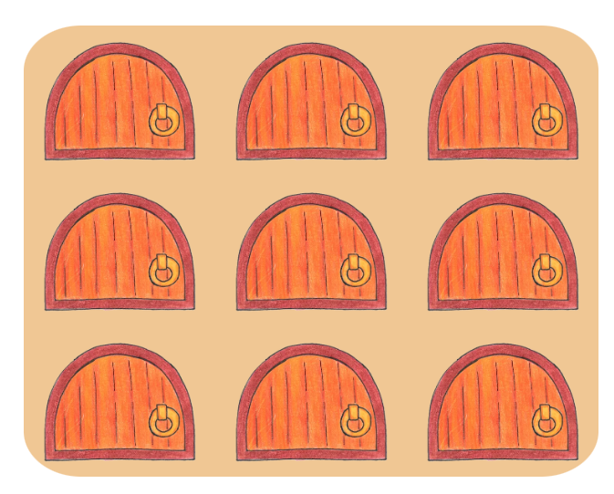

This is a mini game. You are invited to hunt some mice for dinner. You can choose a character and enter your name. There are only 6 tries for one game. You should find 5 mice to win. Good luck!

Live link [`Mice hunting`](https://vl-ocean.github.io/mice-huntung/)

## User Experience (UX)

To ensure the quality and efficiency of the project, I started it by following the Five Planes of UX. I have noted the outcome in a separate document titled ["Project 2"](./README-files/project-2.md). (*You can click on the file name to view it*)

 ### Strategy level
The first thing to do was to think about user goals and needs. The main idea is to bring joy to the user. Therefore I have outlined 4 main needs:
  - Have fun!
  - Feed the cat!
  - Make the right choice!
  - Use your sixth sense

 ### Scope level
It has two branches Content Requirements and Functional specification. 

#### 1. Content Requirements
I thought through how the user would go through the game, step by step. I have asked myself two main questions: **What would the user see?** and **What would the user do to use the application?** I have written down the outcome in the 'App steps/functionality' section of the document.

#### 2. Functional specification
The main game idea is to make it possible for the user to click on the box and get different result based on the "element" hiding behind it. So that every new round, it was fun and it had an element of guessing or using the sixth sense. 

It was important for me to understand whether I can make it random and make the game actually work. I have done my research. I found out that the array containing the objects will be perfect to make it happen. Now I had to find how to mix the objects inside the array randomly, to shuffle. The source https://stackoverflow.com/a/12646864 had what I was looking for. 

In the 'JavaScript functions' section I have written down some names of the functions I would use, their description and how they would connect and follow each other building the game functionality. It was a sketch of what I would later build in JavaScript. 

Alongside the functions I have thought through some of the global variables and written them down in the 'JavaScript global variables' section.

 ### Structure level
While working on the content and functionality, I have dived into Interaction and Information design. I have enlarged the previous two sections and added more details about sections for one page layout game. I have added the 'Buttons' section and described their functions. Then I added 'Other' section, defining the instructions and game terms.

 ### Skeleton level
Once the functionality seemed complete and doable, I have moved on to the Interface design and how it would look for the user. 

To decide on colours and fonts I have asked for help. The illustrations I used in the game has been drawn by my sister. I have noted the fonts and colours I would use in the 'Design' section of the project 2 file.

In Balsamic I have created the wireframes of each version of layout (mobile, laptop, desktop). 

 ### Surface level (finalised design)

- **Fonts**: Caudex, Comfortaa 

- **Colours**: `#BD6E2A` orange, `#221916` brown, `#fff` white; 

- **Wireframes**
   - Mobile layout
     - [Start area](./README-images/mobile-start-area.png)
     - [Game area](./README-images/mobile-game-area.png)
     - [Result area](./README-images/mobile-result-area.png)
   - Tablet layout
     - [Start area](./README-images/tablet-start-area.png)
     - [Game area](./README-images/tablet-game-area.png)
     - [Result area](./README-images/tablet-result-area.png)
   - Desktop layout
     - [Start area](./README-images/desktop-start-area.png)
     - [Game area](./README-images/desktop-game-area.png)
     - [Result area](./README-images/desktop-result-area.png)

## Technologies Used 

 ### Languages Used 
- HTML5 
- CSS3
- JavaScript

 ### Programes Used
 - #### [Git](https://gitpod.io/)
Git was used for version control by utilizing the Gitpod terminal to commit to Git and Push to GitHub.
  - #### [GitHub](https://github.com/)
GitHub is used to store the project's code after being pushed from Git.
  - #### [GitPod](https://www.gitpod.io/)
Gitpod was used as a platform to develop code in a ready-to-code developer environment.
 - #### [Balsamic](https://balsamiq.com/)
Balsamiq was used to create the wireframes during the design process

## Existing Features 
The game has three areas: start area, game area and result area. The [start area](./README-images/start-area.png) main functionality is to get the user`s name and remember the selected character. The [game area](./README-images/game-area.png) allows the user to participate in the game by clicking on the doors and opening them. The output is either a mouse or an empty place. The [result area](./README-images/result-area.png) is showing the outcome after the game was played.

- ### Title

 #### The game name represetns the main game functionality "to hunt the mice".

- ### Sound off / Sound on icons
 
 
 #### It allows the user to control the sounds in the game. The default setting is mute. The user can turn it on by clicking the icon.

- ### Username
 
 #### The field to enter the name. It accepts only English letters and whitespace. The user is entitled to enter at least one character. The maximum characters is set to 20. The entered output is used in messages later in the game and result areas.

 - ### Choose character
 
 #### The user can choose from 3 characters. When clicking a character, it gets a border to highlight that it has been selected.

  - ### Instructions
 
 #### The user can read simple rules of the game and understand what to expect at the next area.

  - ### Start game button
 
 
 #### Once the user is ready, he can click on the button and if the name and character are selected, the game begins.

  - ### Game area information display
 
 #### It includes the selected character picture, the score and the number of attempts. It also displays a message.

  - ### Game field
 
 #### The interactive part of the game. Every door is clickable. The expected output is either a mouse or an empty space. There are always 6 mice and 3 empty spaces. The order changes for every game/round.

  - ### Restart/Play again buttons
 

 #### Both buttons provide the same functionality. It takes the user to a new game area which is ready to play another round.

  - ### Result area information display
 
 #### It includes the selected character picture either happy or sad, the total score and a message.

  - ### Exit button
 
 #### This button at game area and at result area provides the same functionality. It takes the user to the start area, it refreshes the username and character. The game can be started again, once the player is ready.

  - ### 404 page
 
 #### It provides a user with click-on button. It takes the user to the start area of the game (home page of the website).

## Future features 
- A wider variety of messages 
- Animation for the game field and characters
- A wider selection of characters
- Bonus level 
- Score board

## Testing  

### Responsiveness
The game can be played on all devices from 360px to large screens. Its width is limited as it is a mini-game.

Screen resolution | Pass
--- | :---:
320px | &check;
360px | &check;
768px | &check;
1024px | &check;
1440px | &check;
1920px | &check;

### Supported browsers
The game was tested on the following browsers and is working well:

Browser | Pass
--- | :---:
Chrome | &check;
Opera | &check;
Firefox | &check;
Microsoft Edge | &check;

### Validator Testing 
- #### HTML
  No errors or warnings to show.
    - [Main page](./README-images/html-validation.png)
    - [404 page](./README-images/404-html-validation.png)
- #### CSS
   No errors or warnings to show. (Except for the warning about imported Google Fonts "Imported style sheets are not checked in direct input and file upload modes")
    - [Overall result](./README-images/css-validation.png)
    - [Warning](./README-images/css-warning.png)
- #### JSHint
  No errors or warnings to show. 
    - [Overall result](./README-images/jshint-validation.png)

### Accessibility and performance
Using Google Lighthouse I confirmed that the website is readable and accessible. It performs well.
  - Home page
    - [Desktop](./README-images/desktop-lighthouse.png)
    - [Mobile](./README-images/mobile-lighthouse.png)
  - 404 page
    - [Desktop](./README-images/404-desktop-lighthouse.png)
    - [Mobile](./README-images/404-mobile-lighthouse.png)

### Functional testing

Action |  Expected result | Pass
--- | --- | :---:
Enter the link "https://vl-ocean.github.io/mice-huntung/" in the address bar | Open the game start area | &check;
Click on the "sound off" icon at top right corner | Change icon to "sound on", the sound is on | &check;
Click on the "sound on" icon at top right corner | Change icon to "sound off", the sound is off | &check;
Type in nothing in the username field and choose no character, click on start game button | Open message "Please enter your name" ([see](./README-images/enter-name.png)) | &check;
Type in nothing in the username field but choose a character, click on start game button | Open message "Please enter your name" ([see](./README-images/enter-name.png)) | &check;
Type in few whitespaces in the username field and choose no character, click on start game button | Open message "Please enter your name" ([see](./README-images/enter-name.png)) | &check;
Type in numbers in the username field, e.g. "123", click on start game button | Open message "Please use letters only and one whitespace if you enter two words, e.g. "Tom Hank". No digits or special characters are allowed" ([see](./README-images/use-letters.png)) | &check;
Type in more than 20 characters in the username field, click on start game button | Open message "You can use up to 20 characters only" ([see](./README-images/20-only.png)) | &check;
Type in the username, e.g. "George", do not select a character, click on start game button | Open message "Please choose a character" ([see](./README-images/no-character-selected.png)) | &check;
Click on the character at start area | Highlight the selected character ([see](./README-images/character-selected.png)) | &check;
Click on another character at start area | Highlight the clicked character, deselect the previous character | &check;
Type in the username, e.g. "George", and select a character, e.g. "grey cat", then click on start game button | Open game area. Display grey cat as a character and the message "Feed me, George" ([see](./README-images/feed-me.png)) | &check;
Click on "Exit" button at game area | Open start area | &check;
Click on "Exit" button at result area | Open start area | &check;
Click on a door | Change image to mouse, increase score by one, reduce tries by one, display message "Excellent, George" | &check;
Click on a door | Change image to empty, reduce tries by one, display message "Don't worry, George" | &check;
Use the last try | Display the last choice result, then open result area | &check;
Find 5 mice in a row (one try is left to use) | Open result area, display win result ([see](./README-images/display-win.png)) | &check;
Use three tries, click on "Restart" button | Open new game area, ready for a new round ([see](./README-images/restart-clicked.png)) | &check;
Click on the next door before the soundtrack of the previous one has ended | Stop the sound, new sound is played from the beginning | &check;
Find four mice and two empties at game area | Open result area, display sad character, message "Better luck next time, George!" and the total score of 4 ([see](./README-images/display-loss.png)) | &check;
Find 5 mice and 1 empty at game area | Open result area, display happy character, message "Well done, George!" and the total score of 5 ([see](./README-images/display-win.png)) | &check;
Click on "Play again" button | Open new game area, ready for a new round ([see](./README-images/restart-clicked.png)) | &check;
Enter broken link in the address bar | Open custom 404 page ([see](./README-images/broken-link.png)) | &check;
Click on the character at start area, sound is on | Hear cat sound being played | &check;
Click on the door, sound is on | Hear open-door sound being played | &check;
Win game, sound is on | Hear win sound being played | &check;
Lose game, sound is on | Hear loss sound being played | &check;
Click on any button, sound is on | Hear click sound being played | &check;
Click on the character at start area, sound is off | Hear no sound being played | &check;
Click on the door, sound is off | Hear no sound being played | &check;
Win game, sound is off | Hear no sound being played | &check;
Lose game, sound is off | Hear no sound being played | &check;
Click on any button, sound is off | Hear no sound being played | &check;

### Fixed Bugs

- The assignCharacter function didn't work properly. The problem was in setting the background-image url and inserting it as a new style for the element. When looking through some tutorials (W3Schools, Stackoverflow), I have realised that I have set it wrong. I changed it to "url(" + chosenCharacter + ")", then I updated url in the object to "url('./assets/images/grey.webp')", so I can use a variable instead of concatenating and it worked perfectly this way.

- All the variables were created using "let". Replaced the permmanent variables with "const".

- Replaced the for..of function to forEach, since it fits the arrays better.

- There is no control over the sound for the user. Added icons at top right corner and muted it by default. Now the user can turn the sound on if wants.

- First two functions which add Event listeners to buttons and characters were too big and shown warnings in JSHint. I divided them into two smaller ones.

- When validating the html, I got the warning ["Possible misuse of aria-label"](./README-images/html-warning.png). The aria-label was used for the div containers which have background images. These images are the main game functionality and the screen reader should see them and identify. The source https://www.w3schools.com/accessibility/accessibility_meaningful_images.php explains how to inform the browser that the particular image is important and should be read by the screen reader. I have added 'role="img"' next to aria-labels created before. No warnings has been discovered since.

- The validation of the username (regular expression) is set for letters and spaces (for example, "Tom Hank"). It has a bug of accepting a name consisting only of whitespaces. To fix it, I replaced a pattern with a better one '/^[A-z]+\s?[A-z]*$/'. I used test method instead of match and added trim method to remove all whitespaces at the beginning and the end of entered words. Now the name accepted cannot have more than one whitespace.

### Unfixed Bugs

- After the user used last try, if he quickly clicks on "Restart" button, he cannot start the new game immediately. The result area will show up anyways, but the total score will be reset to 0, due to countResult function working and calling the displayWin/Loss functions with a delay of 1200ms.

## Deployment
- ### Github pages
    - This project was deployed to GitHub Pages using the following steps
      - Log in to GitHub and locate the GitHub Repository
      - At the top of the Repository (not the top of the page), locate the "Settings" Button on 
        the menu.
      - Scroll down the Settings page until you locate the "GitHub Pages" Section.
      - Under "Source", click the dropdown called "None" and select "Master Branch".
      - The page will automatically refresh.
      - Scroll back down through the page to locate the now published site link in the "GitHub Pages" section.
      - live link for the page can be found here [Mice hunting](https://vl-ocean.github.io/mice-huntung/)
- ### Forking the GitHub Repository
    - By forking the GitHub Repository we make a copy of the original repository on our GitHub account to view and/or make changes without affecting the original repository by using the following steps
     - Log in to GitHub and locate the GitHub Repository
     - At the top of the Repository (not the top of the page) just above the "Settings" Button on the menu, locate the "Fork" Button.
     - You should now have a copy of the original repository in your GitHub account.
- ### Making a Local Clone
   - Log in to GitHub and locate the GitHub Repository
   - Under the repository name, click "Clone or download".
   -  To clone the repository using HTTPS, under "Clone with HTTPS", copy the link.
   - Open Git Bash
   - Change the current working directory to the location where you want the cloned directory to be made
   - Type git clone, and then paste the URL you copied in Step 3.
      - $ git clone https://github.com/YOUR-USERNAME/YOUR-REPOSITORY
   - Press Enter. Your local clone will be created.

## Credits 

  - ### Tutorials & Content  
    - [Code institute](https://learn.codeinstitute.net/) - The tutorials and walkthrough projects.
    - [W3Schools](https://www.w3schools.com/) - The information about HTML, CSS and JavaScript.
    - [MDN](https://developer.mozilla.org/en-US/) - The information about HTML, CSS and JavaScript.
    - [Stackoverflow](https://stackoverflow.com/) - The use of JavaScript to change html and styles.

  - ### Graphics
    - [Google fonts](https://fonts.google.com/knowledge) - The Fonts were imported from this library.
    - [Fontjoy](https://fontjoy.com/) - This tool was used to find the matching font-families for the design.
    - [ColorSpace](https://mycolor.space/) - This tool was used to find the most suitable colors for the design.
    - [Adobe Color Contrast Checker](https://color.adobe.com/create/color-contrast-analyzer) - This tool was used to check contrast for text and background colors.
    - [hex to rgba](https://rgbacolorpicker.com/hex-to-rgba) - This tool was used to convert hex value of color into rgba, for the form on the tablet layout.
    - [Font Awesome](https://fontawesome.com/) - The icons are taken from this library.

  - ### Media
    - [Favicon](https://www.favicon.cc/) - The tool was used to create a favicon.
    - [Mixkit](https://mixkit.co/) - Soundtracks and background music.
    - [Audio Trimmer](https://audiotrimmer.com/) - Cut soundtracks.

  - ### Illustrations
    - The illustrations were drawn by hand and digitalized. The author - my sister, Anastasiia.
    
  - ### Acknowledgment
    - [Cohort Facilitator - Marko Tot](https://github.com/tmarkec) for support in the classroom and guidance through the course.
    - [Mentor - Dick Vlaanderen](https://github.com/dickvla) for support throughout the project, ideas and advice.
    - My colleague [Kostiantyn Krysenko](https://github.com/barkode) for advice and knowledge sharing.
    - My sister Anastasiia for help in design and graphic content.